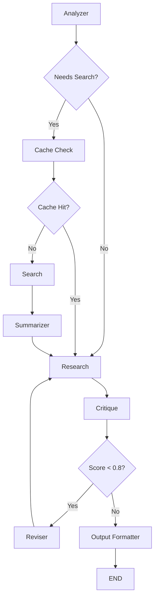

# 🔬 Advanced AI Research Agent

An autonomous, multi-agent research pipeline powered by **LangGraph** and **Google Gemini**. This agent performs deep analysis, web searches, reflection, and iterative refinement to produce high-quality, cited research reports.


## 🌟 Key Features

- **Multi-Agent Orchestration**: A sophisticated graph-based workflow involving specialized nodes for Analysis, Search, Summarization, Research, Critique, and Revision.
- **Intelligent Search Cache**: Uses **ChromaDB** to cache previous search results, reducing latency and API costs for redundant queries.
- **Iterative Refinement**: A "Critique & Revise" loop ensures the final report meets high quality and accuracy standards.
- **Citation Tracking**: Automatically collects and formats sources to ensure all claims are backed by verifiable data.
- **Real-time Performance Metrics**: Tracks LLM calls, token usage, and estimated costs in real-time.
- **Premium Streamlit UI**: A dark-themed, responsive dashboard for interacting with the agent and visualizing results.

## 🏗️ Architecture

The agent follows a cyclical research workflow defined in [graph.py](file:///d:/Langgraph/agent/graph.py):



### Node Breakdown:
- **Analyzer**: Rewrites the query and decomposes it into 3 sub-queries.
- **Cache Check**: Performs a semantic search in ChromaDB to find existing summaries.
- **Search**: Executes advanced web searches via **Tavily**.
- **Summarizer**: Condenses raw web data into a dense context.
- **Research Agent**: Drafts the initial report based on gathered context.
- **Critique Agent**: Scores the report and provides feedback for improvement.
- **Reviser Agent**: Incorporates feedback to refine the report.
- **Output Formatter**: Transforms the research into a beautifully styled Markdown report with citations.

## 🛠️ Tech Stack

- **Orchestration**: [LangGraph](https://github.com/langchain-ai/langgraph)
- **LLM**: [Google Gemini 2.5 Flash Lite](https://ai.google.dev/)
- **Search**: [Tavily API](https://tavily.com/)
- **Vector Database**: [ChromaDB](https://www.trychroma.com/)
- **Frontend**: [Streamlit](https://streamlit.io/)
- **Environment**: [Dotenv](https://github.com/theskumar/python-dotenv)

## 🚀 Getting Started

### Prerequisites

- Python 3.10+
- Google Gemini API Key
- Tavily API Key

### Installation

1. **Clone the repository**:
   ```bash
   git clone <repository-url>
   cd Langgraph
   ```

2. **Set up a virtual environment**:
   ```bash
   python -m venv .venv
   source .venv/bin/activate  # On Windows: .venv\Scripts\activate
   ```

3. **Install dependencies**:
   ```bash
   pip install -r requirements.txt
   ```

4. **Configure Environment Variables**:
   Create a `.env` file in the root directory:
   ```env
   GOOGLE_API_KEY=your_gemini_api_key
   TAVILY_API_KEY=your_tavily_api_key
   ```

### Running the Application

#### Streamlit UI (Recommended)
```bash
streamlit run main.py
```

#### CLI Mode
```bash
python main.py
```

## 📂 Project Structure

```text
├── agent/
│   ├── graph.py          # LangGraph definition
│   ├── nodes.py          # Agent node logic (Analyzer, Searcher, etc.)
│   ├── state.py          # Shared state schema
│   ├── utils.py          # LLM config and Token tracking
│   └── __init__.py
├── agent_cache/          # Persisted ChromaDB data
├── main.py               # Streamlit UI & CLI entry point
├── inspect_cache.py      # Utility to view entries in the ChromaDB cache
├── requirements.txt      # Project dependencies
└── .env                  # API keys (not included in git)
```

## 🛠️ Utilities

- **Cache Inspector**: Run `python inspect_cache.py` to view all cached research queries and their stored summaries in the local ChromaDB instance.

## 📜 License

This project is licensed under the MIT License - see the LICENSE file for details.
